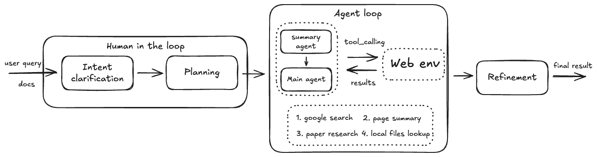

# DR-Agent

DR-Agent 是一个面向深度研究场景的轻量级 Agent，基于 OpenAI Agents SDK 构建。Agent把研究过程拆成几个明确阶段：先澄清用户意图，再生成搜索计划，然后按需调用网页搜索、论文检索和本地文档检索工具，最后把多轮工具调用得到的证据整理成结构化答案。

这个仓库同时覆盖了推理时 Agent 流程和训练时的数据闭环。运行侧重点是“可控研究流程”，训练侧重点是“把真实搜索轨迹整理成可继续 SFT 的监督数据”。因此它既可以作为一个可直接运行的小型 research agent，也可以作为训练检索型/工具型模型的实验骨架。

主要特性：

- 基于 OpenAI Agents SDK 组织多阶段推理与工具调用。
- 支持网页、论文、本地文档三类信息源。
- 默认把搜索和交互过程保存为 Markdown 报告，便于复盘。
- 内置训练流水线：教师模型采样、Weave 轨迹导出、数据增强、ShareGPT 转换、LoRA SFT、合并与评测。



具体参见WandB主页: https://wandb.ai/ximo_ml/deep_research_agent
和项目实验报告: https://wandb.ai/ximo_ml/deep_research_agent/reports/Deep-Research-Agent--VmlldzoxNjY2MzEwMA 

## 安装

```bash
uv venv
source .venv/bin/activate
uv sync
```

## 环境变量

从 `.env.example` 复制出 `.env`，再按需填写：

```env
# ── Inference Backend ──────────────────────────────────────────────
MODEL_NAME_AT_ENDPOINT=
BASE_KEY=
BASE_URL=

# ── Search APIs (at least configure TAVILY_API_KEY) ──────────────
TAVILY_API_KEY=
S2_API_KEY=
LOCAL_DOCS_DIR=

# ── Experiment Tracking ───────────────────────────────────────────
WANDB_API_KEY=
WEAVE_PROJECT=

# ── Teacher Model (for data collection) ──────────────────────────
OPENAI_API_KEY=sk-xxxxxxxxxxxx      # Only for collecting training data

# Download Datasets.(Note: You may need to obtain authorization on the dataset page.)
HF_TOKEN=

# Local_docs Path
LOCAL_DOCS_DIR=
```

说明：

- `MODEL_NAME_AT_ENDPOINT`、`BASE_KEY`、`BASE_URL` 是推理后端必填项。
- `TAVILY_API_KEY` 是网页搜索的关键配置，通常至少要提供这个。
- `S2_API_KEY` 强烈建议配置，这样 Semantic Scholar 检索更稳定。
- `WEAVE_PROJECT`、`WANDB_API_KEY` 主要用于轨迹记录与实验追踪。

## 运行

交互式运行：

```bash
uv run run_agent.py
```

非交互搜索：

```bash
uv run run_agent.py --search "your question"
```

基准评测（SimpleQA / GAIA / Frames）：

```bash
uv run run_agent.py --eval -b simpleqa -n 50
```

搜索与交互报告会写入 `results/`，格式为 Markdown，不直接打印到终端。评测输出位于 `eval_outputs/`，日志位于 `logs/`。

## Training

训练入口主要在 `training/scripts/` 下，整体流程是“采集轨迹 -> 清洗/增强 -> SFT -> 合并部署 -> 评测”。

```bash
# 1. 用教师模型收集 benchmark 训练轨迹
bash training/scripts/run_teacher.sh

# 2. 下载 Weave traces，提取轨迹，做增强，构建 ShareGPT SFT 数据，
#    并启动 LLaMA-Factory 训练
bash training/scripts/run_training.sh

# 3. 合并 LoRA adapter，并启动本地 vLLM 服务
bash training/scripts/run_merge.sh

# 4. 在保留测试集上评估合并后的模型
bash training/scripts/run_eval.sh
```

关键动作:

- 轨迹采集：通过教师模型跑完整 Agent 流程，把真实工具调用过程记录下来，而不是只保留最终答案。
- 实验追踪：利用 Weave / W&B 保存调用记录，后续再导出为本地 JSONL。
- 数据抽取与构造：从 Weave 轨迹中拆出意图澄清、搜索规划、搜索执行、答案生成等训练样本。
- 数据增强：`training/augment_data.py` 会基于教师模型做合成增强，包括 intent、answer 和 observation reuse 等类型，尽量复用已有工具观测，减少额外搜索成本。
- SFT 数据格式：训练前会把数据转换为 ShareGPT 格式，供 LLaMA-Factory 直接消费。
- 训练方法：使用 LLaMA-Factory 进行监督微调，配合 LoRA / PEFT 做参数高效训练。
- 部署与评测：训练后的 LoRA adapter 会被合并为独立权重，再通过 vLLM 本地部署，并在 SimpleQA、GAIA、Frames 等基准上回测。

补充说明：

- `run_training.sh` 默认开启 augmentation，并使用 `http://localhost:8001/v1` 上的 teacher endpoint。需要时可通过 `AUGMENT_BASE_URL`、`AUGMENT_MODEL_NAME`、`AUGMENT_NUM_INTENT`、`AUGMENT_NUM_ANSWER`、`AUGMENT_NUM_REUSE` 覆盖。
- `run_eval.sh` 默认评测 `http://localhost:8000/v1` 上的合并模型，并支持通过 `FRAMES_EVAL_N`、`SIMPLEQA_EVAL_N`、`GAIA_EVAL_N` 调整评测规模。

## Tools

- `web_search`：基于 Tavily 的网页候选检索。
- `fetch_webpage`：抓取网页并提取可读正文。
- `paper_search`：面向学术论文的检索工具，支持多来源回退。
- `local_docs_lookup`：本地文件和目录检索。

